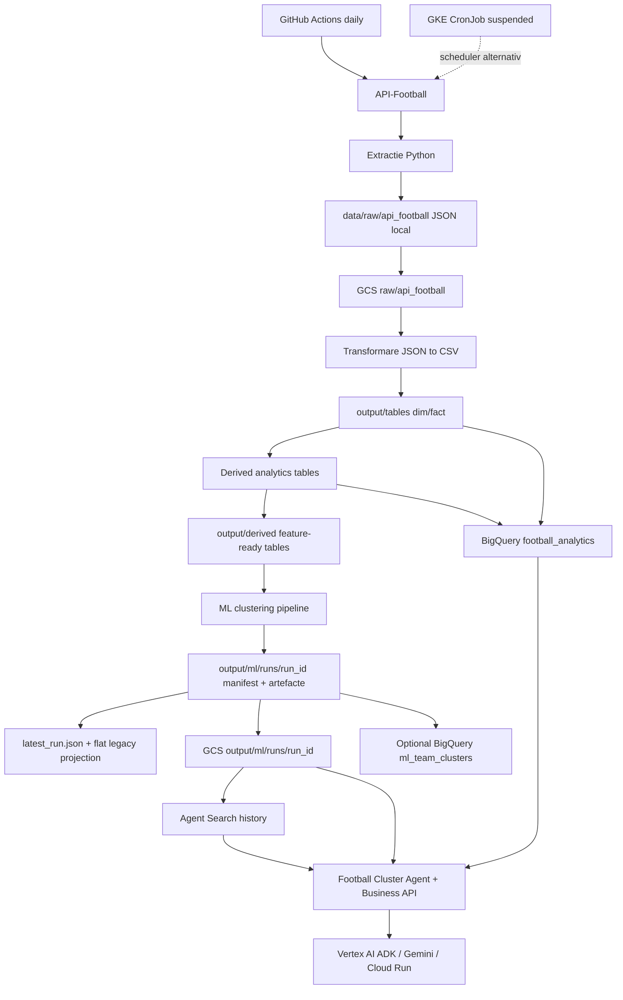

# Documentatie proiect - perspectiva ML, Cloud si Data

Document verificat fata de cod si artefactele locale la `2026-08-10`.
Ultima rulare locala si publicata valida observata este `20260817T115844Z`: 380 de meciuri,
20 de echipe si date pana la `2025-05-25`.

## 1. Rezumat

Proiectul implementeaza un pipeline complet de football analytics pentru La Liga, sezonul 2024. Fluxul porneste de la date brute extrase din API-Football, le transforma in tabele analitice locale, le poate incarca in Google Cloud Storage si BigQuery, apoi ruleaza un pipeline ML de clustering pentru segmentarea echipelor.

Accentul tehnic al proiectului este pe:

- **Data Engineering**: ingestie API, persistenta raw, transformare JSON in tabele `dim`/`fact`, tabele derivate si feature tables.
- **Cloud**: Google Cloud Storage pentru landing zone si artefacte versionate, BigQuery pentru warehouse analitic, Vertex AI ADK/Gemini pentru agent, Agent Search pentru istoric semantic, Cloud Run pentru agent si cost guard.
- **Machine Learning**: feature engineering la nivel de echipa, clustering nesupervizat, comparatie multi-algoritm, selectie automata, interpretabilitate si rapoarte.
- **MLOps**: rulari imutabile cu manifest si pointer `latest`, configurare YAML, metrici JSON, teste automate, scheduler GitHub si modul optional de stabilitate.
- **Serving**: agent conversational, API FastAPI/OpenAPI si containere/manifeste GKE pentru invatare Kubernetes.

Scopul modelului de clustering nu este predictia scorurilor, ci identificarea unor arhetipuri de echipe: echipe dominante ofensiv, echipe defensive puternice, echipe mixte si outlieri. Forecast-ul 1/X/2 este un baseline Poisson separat, necalibrat.

## 2. Stack tehnologic

| Zona | Tehnologii / servicii |
|---|---|
| Ingestie date | API-Football, `requests`, `python-dotenv` |
| Procesare date | Python, pandas, numpy |
| Stocare cloud | Google Cloud Storage |
| Warehouse | BigQuery |
| ML | scikit-learn, hdbscan optional, PCA, clustering algorithms |
| Experiment tracking | MLflow optional |
| Vizualizare artefacte | matplotlib, seaborn |
| Agent AI | Vertex AI ADK, Gemini, BigQuery, GCS |
| Cautare istorica | Agent Search / Discovery Engine, JSONL versionat |
| API business | FastAPI, Uvicorn, OpenAPI |
| Deployment | Docker, Cloud Run; manifeste GKE pregatite, nu cluster creat automat |
| Orchestrare | GitHub Actions zilnic; Kubernetes CronJob suspendat implicit |
| Testare | pytest |
| Cost control | Cloud Function / Pub/Sub style cost guard pentru scalarea Cloud Run la 0 |

## 3. Arhitectura end-to-end



Fluxul are natura batch. Datele sunt extrase, procesate si modelate periodic, iar rezultatul ML este un set de artefacte care pot fi analizate, incarcate in cloud sau consumate de un agent AI.

## 4. Structura proiectului

```text
data science project/
  run_extract.py
  run_features.py
  run_ml.py
  run_reporting.py
  requirements.txt
  requirements-dev.txt
  Dockerfile.pipeline
  BUSINESS_FEATURES.md
  KUBERNETES_GCP.md
  DOCUMENTATIE_PROIECT.md
  DOCUMENTATIE_ML_CLOUD_DATA.md

  extractdatafromapi/
    extractdata.py
    gcs_uploader.py
    main.py

  data_engineering/
    transform_data_local.py
    derive_tables_local.py
    load_to_bigquery.py
    run_all_local.py

  ml/
    configs/team_clustering_config.yaml
    features/build_team_features.py
    clustering/
    reporting/
    stability/
    utils/

  business/
    agent_search_cloud.py
    agent_search_documents.py
    cluster_stability_rules.py

  football-cluster-agent/
    football_agent/
    business_api/
    cost_guard/
    Dockerfile
    Dockerfile.api
    README.md

  k8s/
  scripts/
  tests/
  .github/workflows/daily-extract.yml

  data/raw/
  output/tables/
  output/derived/
  output/ml/
```

Entrypoint-uri importante:

| Fisier | Rol |
|---|---|
| `run_extract.py` | Extractie API-Football si upload raw in GCS. |
| `run_features.py` | Transformare raw JSON si construire tabele derivate. |
| `run_ml.py` | Rulare pipeline ML de clustering. |
| `run_reporting.py` | Regenerare raport ML din artefactele existente. |
| `data_engineering/run_all_local.py` | Pipeline end-to-end: extractie, upload, transformare, derivare, ML, upload output, BigQuery. |

## 5. Surse de date si ingestie

Sursa primara este API-Football:

```text
https://v3.football.api-sports.io
```

Configurarea curenta din `extractdatafromapi/main.py`:

| Parametru | Valoare |
|---|---|
| Competitie | La Liga |
| `league_id` | `140` |
| Sezon | `2024` |
| Tara metadata ligi | `Spain` |
| `MAX_FIXTURES_PER_RUN` | `25` |
| `MAX_PLAYERS_PAGE` | `3`, limitare pentru planul API curent |

Entitati extrase:

- `leagues`
- `teams`
- `standings`
- `fixtures`
- `players`
- `fixture_events`
- `fixture_statistics`
- `fixture_lineups`
- `fixture_players`

Mecanisme de robustete:

- cheia API este citita din environment prin `API_FOOTBALL_KEY`;
- request-urile au timeout si retry;
- codul trateaza explicit HTTP `429`;
- exista throttling intre request-uri;
- payload-ul API este verificat pentru erori, nu doar status code-ul HTTP;
- fisierele deja extrase pot fi sarite local sau remote;
- erorile pe o entitate nu opresc obligatoriu intreaga extractie.

Structura raw:

```text
data/raw/api_football/{entity}/{extraction_date}/{filename}.json
```

Exemplu:

```text
data/raw/api_football/fixtures/2026-04-28/fixtures_league_140_2024.json
```

In cloud, aceeasi zona raw este replicata in GCS:

```text
gs://{GCS_BUCKET}/raw/api_football/{entity}/{date}/{filename}.json
```

## 6. Data Engineering

### 6.1 Stratul raw

Stratul raw pastreaza raspunsurile JSON originale. Acest lucru este important pentru audit, reprocessing si reproducibilitate. Daca logica de transformare se schimba, datele pot fi regenerate din acelasi raw snapshot fara a apela din nou API-ul.

### 6.2 Stratul base: `output/tables`

`data_engineering/transform_data_local.py` citeste JSON-urile din GCS, extrage campul `response`, aplatizeaza structurile nested si scrie CSV-uri curate in `output/tables`.

Fiecare rand primeste metadate de lineage:

- `ingestion_date`
- `source_file`

Catalog local observat:

| Tabel | Randuri | Coloane | Rol |
|---|---:|---:|---|
| `dim_leagues.csv` | 35 | 25 | Ligi, sezoane, tara si acoperire API. |
| `dim_teams.csv` | 20 | 14 | Echipe, metadata si stadion. |
| `fact_matches.csv` | 380 | 34 | Meciuri, scoruri, status, stadion, arbitru. |
| `fact_match_events.csv` | 852 | 14 | Evenimente de meci: goluri, cartonase, schimbari. |
| `fact_match_lineups.csv` | 2240 | 14 | Formatii, titulari, rezerve, antrenori. |
| `fact_match_player_stats.csv` | 2240 | 40 | Statistici jucator la nivel de meci. |
| `fact_match_team_stats.csv` | 1800 | 7 | Statistici echipa in format long. |
| `fact_player_season_stats.csv` | 88 | 57 | Statistici agregate jucatori pe sezon. |
| `fact_standings.csv` | 20 | 30 | Clasament pe liga, sezon si echipa. |

### 6.3 Stratul derived: `output/derived`

`data_engineering/derive_tables_local.py` construieste tabele analitice peste stratul base. Aceste tabele sunt mai apropiate de consumul BI si ML.

Constanta importanta:

```text
ROLLING_WINDOW = 5
```

Forma recenta a unei echipe este calculata pe ultimele 5 meciuri, folosind informatia disponibila inainte de meciul curent.

Catalog local observat:

| Tabel | Randuri | Coloane | Rol |
|---|---:|---:|---|
| `dim_coaches.csv` | 20 | 4 | Dimensiune antrenori. |
| `dim_players.csv` | 590 | 12 | Dimensiune jucatori. |
| `dim_venues.csv` | 21 | 5 | Dimensiune stadioane. |
| `fact_head_to_head.csv` | 190 | 8 | Istoric intre perechi de echipe. |
| `fact_match_features.csv` | 380 | 28 | Feature table la nivel de meci. |
| `fact_match_long.csv` | 760 | 17 | Doua randuri per meci: perspectiva home si away. |
| `fact_match_team_stats_wide.csv` | 100 | 21 | Pivot stats echipa din long in wide. |
| `fact_player_minutes_summary.csv` | 551 | 9 | Minute, rating, titularizari, rezerve. |
| `fact_referee_stats.csv` | 20 | 6 | Agregari arbitri. |
| `fact_standings_snapshot.csv` | 20 | 30 | Snapshot clasament. |
| `fact_team_form.csv` | 760 | 21 | Forma echipei inainte de fiecare meci. |
| `fact_top_scorers.csv` | 555 | 14 | Goluri, assist-uri, contributii. |

### 6.4 Control anti data leakage

Pentru ML si modele predictive viitoare, cel mai important detaliu este ca feature-urile de forma folosesc `shift(1)` inainte de rolling window. Practic:

```text
feature pentru meciul X = informatii din meciuri anterioare meciului X
```

Aceasta reduce riscul de data leakage temporal. `fact_match_features.csv` poate deveni baza pentru modele predictive viitoare, deoarece contine si target-uri precum:

- `target_result`: `H`, `A`, `D`
- `target_total_goals`

## 7. Cloud si arhitectura GCP

### 7.1 Google Cloud Storage

GCS este folosit ca zona de persistenta pentru:

- raw JSON: `raw/api_football/...`
- output procesat: `output/tables`, `output/derived`, `output/ml`
- istoric ML imutabil: `output/ml/runs/<run_id>/...`
- pointer catre ultima rulare valida: `output/ml/latest_run.json`
- proiectie flat compatibila: `output/ml/clusters`, `metrics`, `report`, `plots`
- documente Agent Search: `output/ml/runs/<run_id>/search/agent_search_documents.jsonl`

Rol arhitectural:

- separa datele brute de procesarea locala;
- permite rerun-uri si consum cloud-native;
- ofera o sursa comuna pentru pipeline si agent;
- pastreaza artefactele ML intr-un format usor de citit;
- permite comparatii intre rulari fara suprascrierea istoricului.

Publicarea unei rulari este failure-safe: sunt acceptate numai manifestele
`SUCCEEDED`; fisierele versiunii sunt uploadate imutabil, manifestul este
publicat dupa artefacte, iar pointerul remote avanseaza numai dupa verificare.
O rulare `FAILED` ramane auditabila, dar nu devine `latest`.

### 7.2 BigQuery

`data_engineering/load_to_bigquery.py` incarca CSV-urile din:

- `output/tables/*.csv`
- `output/derived/*.csv`

Default-uri:

```text
Dataset: football_analytics
Location: europe-central2
Write mode: WRITE_TRUNCATE
Schema: autodetect
```

Observatie: `WRITE_TRUNCATE` inseamna ca fiecare rulare inlocuieste complet tabelele. Este simplu pentru un proiect batch, dar pentru productie ar fi recomandata pastrarea istoricului pe `run_date` sau `snapshot_date`.

Pipeline-ul ML poate incarca separat clusterele in BigQuery daca se seteaza in YAML:

```yaml
output:
  load_to_bigquery: true
  bq_table: ml_team_clusters
```

### 7.3 Agent AI peste date

`football-cluster-agent/` este un layer read-only peste BigQuery si GCS. Agentul foloseste Vertex AI ADK + Gemini si expune tool-uri pentru:

- listarea ultimei rulari ML;
- citirea raportului de clustering;
- citirea metricilor;
- explicarea unui cluster;
- compararea a doua echipe;
- query-uri BigQuery controlate;
- similaritate personalizata fara schimbarea clusterului oficial;
- forecast Poisson, dossier adversar si audit walk-forward;
- alerte, player-team fit, scenarii de absente si fan briefing;
- cautare semantica peste rularile istorice prin Agent Search.

Agentul are protectii importante:

- accepta doar query-uri `SELECT`;
- blocheaza comenzi DML/DDL precum `INSERT`, `UPDATE`, `DELETE`, `DROP`, `CREATE`;
- blocheaza `bigquery-public-data`;
- forteaza folosirea dataset-ului configurat;
- limiteaza bytes billed la 5 GB per query.

### 7.4 Cloud Run si cost guard

Agentul are imagine Docker si un serviciu Cloud Run documentat in
`football-cluster-agent/README.md`. URL-ul stabil consemnat acolo este
`https://football-agent-hzdooca3ia-uc.a.run.app/dev-ui/`; disponibilitatea externa
trebuie verificata separat de acest audit local. Exista si `Dockerfile.api` pentru
API-ul FastAPI. Modulul `cost_guard` poate seta `maxInstanceCount = 0` pentru un
serviciu Cloud Run daca un prag de cost este depasit.

Acest mecanism este util pentru demo, proiecte academice sau medii unde costul trebuie limitat strict.

### 7.5 Variabile de mediu

Pentru pipeline:

| Variabila | Rol |
|---|---|
| `API_FOOTBALL_KEY` | Cheia API-Football. |
| `GCS_BUCKET` | Bucket pentru raw si output. |
| `GCP_PROJECT_ID` | Proiect GCP pentru GCS/BigQuery. |
| `BQ_DATASET` | Dataset BigQuery. |
| `BQ_LOCATION` | Locatie BigQuery, default `europe-central2`. |

Pentru agent:

| Variabila | Rol |
|---|---|
| `GOOGLE_CLOUD_PROJECT` | Proiect GCP pentru agent. |
| `GCP_LOCATION` | Locatie Vertex/GCP. |
| `CLUSTER_BUCKET` | Bucket cu artefacte ML. |
| `BQ_DATASET` | Dataset BigQuery permis. |
| `CLUSTER_OUTPUT_PREFIX` | Prefix artefacte, default `output/ml`. |
| `GOOGLE_GENAI_MODEL` | Model Gemini folosit de agent. |
| `AGENT_SEARCH_DATA_STORE_ID` | Data store-ul pentru istoricul semantic. |
| `AGENT_SEARCH_ENGINE_ID` | Engine-ul de cautare Agent Search. |
| `AGENT_SEARCH_LOCATION` | Locatia Agent Search, curent `global`. |

### 7.6 Agent Search si Kubernetes

Fiecare rulare reusita produce documente JSONL pentru model, clustere, echipe si
capabilitati business. Daca `AGENT_SEARCH_DATA_STORE_ID` este configurat,
pipeline-ul porneste importul incremental dupa publicarea rularii. Un esec al
indexarii optionale nu invalideaza rularea ML deja publicata.

`k8s/` contine Deployment-uri pentru agent si business API, Service-uri interne
`ClusterIP`, service accounts pentru Workload Identity si un CronJob zilnic.
CronJob-ul este `suspend: true`, deoarece GitHub Actions ruleaza deja la
`02:32 UTC`. Se activeaza un singur scheduler. `scripts/deploy_gke.ps1` foloseste
un cluster ales explicit si nu creeaza automat un cluster GKE.

## 8. Machine Learning

### 8.1 Problema ML

Pipeline-ul ML rezolva o problema de invatare nesupervizata:

```text
grupeaza echipele in clustere pe baza profilului statistic si formei recente
```

Unitatea de modelare este echipa, nu meciul. Datele pornesc din `fact_match_features.csv`, iar `ml/features/build_team_features.py` transforma meciurile home/away intr-un tabel cu un rand per echipa.

### 8.2 Feature engineering

Feature-urile configurate in `ml/configs/team_clustering_config.yaml`:

| Feature | Interpretare |
|---|---|
| `avg_goals_scored` | Goluri marcate mediu per meci. |
| `avg_goals_conceded` | Goluri primite mediu per meci. |
| `avg_goal_diff` | Diferenta medie de goluri. |
| `std_goal_diff` | Volatilitatea diferentei de goluri. |
| `win_rate` | Rata victoriilor. |
| `draw_rate` | Rata egalurilor. |
| `loss_rate` | Rata infrangerilor. |
| `avg_points` | Puncte medii per meci. |
| `form_pts_avg` | Puncte medii in forma recenta. |
| `form_gf_avg` | Goluri marcate in forma recenta. |
| `form_ga_avg` | Goluri primite in forma recenta. |
| `form_gd_avg` | Diferenta de goluri in forma recenta. |
| `form_wins_avg` | Victorii recente medii. |
| `form_draws_avg` | Egaluri recente medii. |
| `form_losses_avg` | Infrangeri recente medii. |
| `home_ratio` | Control contextual pentru pondere home/away. |
| `attack_strength` | Feature compozit pentru forta ofensiva. |
| `defense_strength` | Feature compozit pentru control defensiv. |
| `form_score` | Feature compozit pentru forma generala. |

### 8.3 Preprocesare

Config-ul curent:

```yaml
preprocessing:
  fillna: median
  scaler: robust
  pca: true
  pca_components: 6
```

Pipeline-ul suporta:

- imputare prin `median`, `mean` sau `zero`;
- scalare `robust`, `standard`, `minmax` sau fara scaler;
- PCA optional, folosit si pentru coordonatele `pca_x` si `pca_y`.

`RobustScaler` este o alegere buna pentru date sportive, deoarece reduce influenta outlierilor.

### 8.4 Algoritmi

Pipeline-ul ruleaza un sweep de algoritmi si parametri:

- `KMeans`
- `MiniBatchKMeans`
- `GaussianMixture`
- `AgglomerativeClustering`
- `SpectralClustering`
- `Birch`
- `DBSCAN`
- `MeanShift`
- `HDBSCAN`, daca este instalat

Aceasta abordare este potrivita pentru un proiect exploratoriu, deoarece nu presupune din start o forma unica a clusterelor.

### 8.5 Selectie model

Fiecare candidat este evaluat cu:

| Metrica | Directie buna | Rol |
|---|---|---|
| `silhouette` | mai mare | Separare si coeziune. |
| `davies_bouldin` | mai mic | Suprapunere intre clustere. |
| `calinski_harabasz` | mai mare | Raport separare / dispersie interna. |
| `noise_ratio` | mai mic | Pondere de puncte marcate ca zgomot. |
| `balance_ratio` | mai mare | Echilibru intre dimensiunile clusterelor. |
| `composite` | mai mare | Scor combinat folosit implicit. |

Scorul compozit este:

```text
0.45 * silhouette
+ 0.25 * (1 / (1 + davies_bouldin))
+ 0.15 * (log1p(calinski_harabasz) / 10)
+ 0.10 * (1 - noise_ratio)
+ 0.05 * balance_ratio
```

Config-ul selecteaza modelul dupa:

```yaml
comparison:
  select_by: composite
  min_clusters: 2
  max_clusters: 8
```

### 8.6 Rezultat ML curent

Modelul selectat in artefactele locale:

| Camp | Valoare |
|---|---|
| Algoritm | `AgglomerativeClustering` |
| Candidat | `AgglomerativeClustering#2` |
| Parametri | `n_clusters=4`, `linkage=ward` |
| Numar clustere | 4 |
| Noise ratio | 0.0 |
| Silhouette | 0.4480 |
| Davies-Bouldin | 0.4632 |
| Calinski-Harabasz | 16.3186 |
| Balance ratio | 0.0667 |
| Composite | 0.5186 |

Dimensiuni clustere:

| Cluster | Echipe | Interpretare |
|---:|---:|---|
| 0 | 15 | `Competitive mixed-profile teams` |
| 1 | 2 | `Elite attacking giants` |
| 2 | 1 | `Outlier underperforming team` |
| 3 | 2 | `Defensive elite contenders` |

Interpretare:

- Cluster 0 contine majoritatea echipelor cu profil mixt si performanta intermediara.
- Cluster 1 separa Barcelona si Real Madrid ca profil ofensiv puternic.
- Cluster 2 izoleaza Valladolid ca outlier negativ.
- Cluster 3 separa Athletic Club si Atletico Madrid ca profil defensiv solid.

Atentie: `balance_ratio` este mic, deoarece exista clustere de 1 si 2 echipe. Interpretarile clusterelor mici trebuie tratate ca fragile.

### 8.7 Artefacte ML

Artefactele canonice ale fiecarei executii sunt generate in
`output/ml/runs/<run_id>/`; ca tranzitie, aceleasi artefacte principale sunt
proiectate si in caile flat din `output/ml`:

| Artefact | Rol |
|---|---|
| `clusters/clusters.csv` | Rezultat per echipa: cluster, label, PCA, interpretari. |
| `metrics/metrics.json` | Metrici pentru toti candidatii. |
| `metrics/best_model_summary.json` | Rezumatul modelului castigator. |
| `metrics/cluster_interpretation.json` | Interpretari structurate per cluster. |
| `report/cluster_report.md` | Raport human-readable. |
| `plots/*.png` | Vizualizari optionale PCA, heatmap, radar si dimensiuni cluster. |
| `manifest.json` | Status, timestamps, hash-uri, input, config, model si inventarul artefactelor. |
| `search/agent_search_documents.jsonl` | Documente versionate pentru cautarea istorica. |
| `stability/*` | Artefacte optionale, numai cand `stability.enabled: true`. |

Pentru rularea `20260817T115844Z`, ploturile lipsesc din directorul versionat,
iar manifestul explica motivul: `No module named 'matplotlib'`. Fisierele din
caile flat pot fi mai vechi, de aceea auditul trebuie sa porneasca din manifest.

Aceste artefacte sunt utile pentru:

- audit ML;
- prezentari;
- dashboard-uri;
- agentul conversational;
- comparatii intre rulari viitoare.

## 9. MLOps

### 9.1 Reproducibilitate

Elemente deja existente:

- configurare ML declarativa in `team_clustering_config.yaml`;
- `random_state: 42` pentru algoritmii compatibili;
- metrici si parametri salvati in JSON;
- raport regenerabil;
- date cu metadate `ingestion_date` si `source_file`;
- structura clara pentru raw, base, derived si ML artifacts.
- `run_id` UTC pentru fiecare executie si director imutabil separat;
- statusuri `RUNNING`, `SUCCEEDED`, `FAILED` in manifest;
- hash-uri pentru input, config, schema de features si preprocessing;
- `latest_run.json` actualizat atomic numai dupa validarea artefactelor obligatorii;
- fallback temporar la caile flat pentru compatibilitate cu consumatorii vechi;
- publicare GCS a versiunii complete inaintea pointerului remote.

### 9.2 Experiment tracking

MLflow este suportat, dar dezactivat implicit:

```yaml
mlflow:
  enabled: false
  experiment: team_clustering
```

Daca este activat, pipeline-ul poate loga parametri, metrici si artefacte.
Independent de MLflow, versionarea locala si GCS este deja implementata astfel:

```text
output/ml/runs/<run_id>/...
```

### 9.3 Monitorizare si stabilitate

Monitorizarea de baza activa foloseste metricile, manifestele si rapoartele
fiecarei rulari. In plus, `ml/stability/` implementeaza:

- label alignment si stable cluster IDs;
- ARI intre partitii istorice;
- assignment strength fata de centroizi;
- bootstrap stability prin resampling de fixture-uri;
- tranzitii de echipe si matrice de tranzitie;
- snapshot-uri temporale, comparatii intre sezoane si alerte business;
- raport responsabil care separa calitatea geometrica de stabilitatea temporala.

Important: in config-ul curent `stability.enabled: false`. Modulul exista, dar nu
ruleaza automat pana la activarea explicita. Bootstrap-ul exprima consistenta la
resampling, nu probabilitatea de corectitudine, iar o tranzitie nu implica o
cauza tactica.

Controale care raman de completat/automatizat:

- numar minim de echipe;
- numar minim de meciuri;
- procent valori null pe coloane critice;
- verificare dubluri pe chei naturale;
- freshness pentru raw si derived;
- validare schema CSV inainte de BigQuery.

### 9.4 Teste si automatizare

Repo-ul are teste `pytest` pentru:

- lifecycle-ul si imutabilitatea rularilor;
- rezolvarea pointerului si fallback-ul legacy;
- publicarea GCS failure-safe;
- generarea documentelor Agent Search;
- similaritate personalizata si forecast;
- regulile business din agent/API.

Rulare:

```powershell
py -m pytest -q
```

Workflow-ul GitHub programat ruleaza pipeline-ul zilnic, dar nu exista inca un
workflow complet de PR pentru lint, schema validation si intreaga suita de teste.
Testele pentru parsarea JSON, deduplicare si non-leakage raman completari utile.

## 10. Guvernanta, securitate si IAM

Practici bune deja prezente:

- cheile API sunt citite din environment;
- autentificarea GCP foloseste clienti oficiali Google;
- agentul este read-only;
- query-urile BigQuery sunt restrictionate;
- cost guard poate opri scalarea Cloud Run;
- lineage-ul este pastrat prin `source_file` si manifestul rularii;
- exista `.dockerignore`, containere non-root si security context restrictiv in GKE;
- GitHub Actions se autentifica prin Workload Identity Federation;
- GKE separa service account-ul pipeline-ului de cel read-only al agentului/API.

Recomandari pentru productie:

- nu versionati fisiere `.env` reale;
- folositi service accounts separate pentru pipeline si agent;
- aplicati IAM minim:
  - pipeline: Storage Object Admin pentru bucket-ul de lucru, BigQuery Data Editor/Job User;
  - agent: Storage Object Viewer, BigQuery Data Viewer/Job User, Vertex AI User;
- pin-uiti versiunile dependintelor;
- activati scanare de vulnerabilitati pentru imaginea Docker.
- adaugati CI de PR, SBOM si verificari de policy;
- nu expuneti serviciile `ClusterIP` fara ingress autentificat si politici clare.

## 11. Cum se ruleaza

Din folderul proiectului:

```powershell
cd "data science project"
py -m pip install -r requirements.txt
```

Rulare pe etape:

```powershell
py run_extract.py
py run_features.py
py run_ml.py
py run_reporting.py
```

Rulare end-to-end:

```powershell
py data_engineering/run_all_local.py
```

Rulare ML directa:

```powershell
py -m ml.clustering.team_clustering_pipeline --config ml/configs/team_clustering_config.yaml
```

Rulare agent local:

```powershell
cd football-cluster-agent
py -m pip install -r requirements.txt
adk web
```

Rulare API business local, din `football-cluster-agent/`:

```powershell
uvicorn business_api.main:app --reload --port 8081
```

Documentatia OpenAPI devine disponibila la `http://localhost:8081/docs`.

Provisionare Agent Search:

```powershell
py scripts/setup_agent_search.py --project project-73d1e32a-8e68-4750-93c
```

Deploy intr-un cluster GKE existent:

```powershell
.\scripts\deploy_gke.ps1 -Cluster NUMELE_CLUSTERULUI
```

Termenul „local” inseamna filesystem-ul procesului care executa pipeline-ul:
laptop, runner GitHub sau container/pod. Artefactele intermediare sunt create
acolo, apoi rularea reusita este publicata separat in GCS.

## 12. Limitari curente

- Pipeline-ul este batch, nu streaming.
- BigQuery foloseste `WRITE_TRUNCATE`, deci istoricul se pierde daca nu este salvat separat.
- Schema BigQuery este `autodetect`, ceea ce poate produce diferente intre rulari.
- Extractia players este limitata la primele 3 pagini.
- MLflow este optional si dezactivat implicit.
- Clustering-ul curent are clustere dezechilibrate.
- Modulul de stabilitate exista, dar este dezactivat in configuratia curenta.
- Nu exista model registry.
- Forecast-ul Poisson este separat de clustering, necalibrat si nu foloseste automat loturi/accidentari/cote.
- Profilul subiectiv nu este persistat intre sesiuni si nu modifica clusterul oficial.
- Match companion foloseste ultimul snapshot stocat; ingestia live nu este garantata.
- Video evidence nu are ingestie/index licentiat implementat in repo.
- Exista scheduler zilnic, dar nu un CI complet pentru pull requests.
- Manifestele Kubernetes sunt pregatite, insa clusterul GKE nu este creat de repo, iar CronJob-ul este suspendat implicit.

## 13. Directii de evolutie

### Prioritate mare

- Schema validation pentru toate CSV-urile importante.
- Extindere pe mai multe sezoane si parametrizarea ligii/sezonului.
- Activare controlata a stabilitatii si validarea alertelor pe mai multe rulari.
- Calibrarea forecast-ului pe split temporal si compararea cu baseline-uri.
- CI de PR pentru teste, lint, securitate si contracte de date.
- Activare MLflow in mediul de experimentare.

### Prioritate medie

- Dashboard BigQuery / Looker pentru clustere.
- Dashboard pentru forecast audit, alerte si istoric ML.
- Persistenta opt-in a profilurilor personalizate.
- Observabilitate centralizata pentru GitHub Actions, Cloud Run si viitorul GKE.
- Introducere DQ checks inainte de ML.

### Prioritate viitoare

- Model supervised separat pentru `target_result`/`target_total_goals`, dupa acumularea mai multor sezoane.
- Feature store sau tabele feature versionate.
- Backtesting pe mai multe sezoane.
- Model registry pentru modele predictive.
- Date licentiate pentru accidentari, lineups, video sau tracking.

## 14. Concluzie

Proiectul este un exemplu bun de pipeline Data + ML + Cloud: extrage date reale, le transforma in tabele analitice, construieste feature-uri fara leakage evident, ruleaza clustering nesupervizat si expune rezultatul prin artefacte si un agent AI.

Valoarea principala vine din legatura dintre straturile de date si ML:

```text
API raw -> dim/fact -> features temporale -> clustering -> run imutabil -> GCS/Agent Search -> agent/API
```

Din perspectiva de maturizare, versionarea failure-safe, testele de business,
schedulerul zilnic si serving-ul conversational/API sunt deja implementate.
Urmatorii pasi reali sunt data quality mai strict, activarea controlata a
stabilitatii, validarea multi-sezon si calibrarea predictiei separate.
