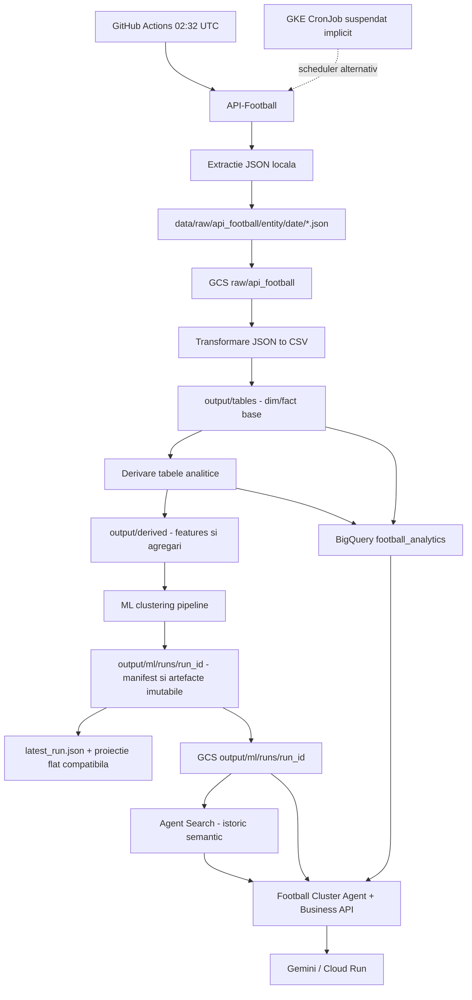

# Documentatie proiect - Football Analytics, Data Engineering, ML si MLOps

## 1. Rezumat executiv

Acest proiect construieste un pipeline complet de analytics pentru fotbal, pornind de la date brute din API-Football si ajungand la:

- fisiere JSON brute versionate pe data de extractie;
- tabele CSV curate de tip dim/fact;
- tabele analitice si feature-ready pentru Data Science;
- modelare ML nesupervizata pentru segmentarea echipelor in clustere;
- artefacte ML explicabile: metrici, interpretari, rapoarte si grafice;
- rulari ML imutabile, manifest de lineage si pointer sigur catre ultima rulare reusita;
- integrare operationala cu Google Cloud Storage, BigQuery, MLflow optional, Agent Search si un agent Vertex AI ADK/Gemini;
- functionalitati business: similaritate personalizata, forecast statistic, scouting, alerte si API FastAPI;
- containere si manifeste Kubernetes/GKE pentru agent, API si pipeline-ul zilnic.

Problema principala de Data Science este identificarea unor arhetipuri de echipe de fotbal, pe baza performantelor, formei recente, eficientei defensive/ofensive si comportamentului pe meciuri. Modelul de clustering nu prezice scoruri. Separat, agentul expune un baseline Poisson necalibrat pentru forecast 1/X/2; acesta este un instrument exploratoriu, nu o probabilitate calibrata si nu recomandare de pariuri.

Documentatie verificata fata de cod si artefactele locale la `2026-08-10`.
Ultima rulare ML locala si publicata valida observata: `20260817T115844Z`, cu date pana la
`2025-05-25`, 380 de meciuri si 20 de echipe.

## 2. Arhitectura la nivel inalt



Componente principale:

- `extractdatafromapi/`: extractie API-Football, throttling, retry, salvare JSON, upload/download GCS.
- `data_engineering/`: transformare JSON in CSV, derivare tabele analitice, incarcare BigQuery, pipeline end-to-end.
- `ml/`: feature engineering de echipa, clustering, evaluare, versionare, stabilitate optionala, interpretare, vizualizare, raportare si MLflow optional.
- `business/`: reguli deterministe pentru alerte de stabilitate si documente/import Agent Search.
- `football-cluster-agent/`: agent read-only fata de sursele de date, functii business si API FastAPI.
- `k8s/`: manifeste pentru agent, business API, service accounts si CronJob-ul pipeline-ului.
- `scripts/`: provisionare Agent Search si build/deploy GKE.
- `tests/`: teste pentru lifecycle-ul rularilor, publicare GCS, personalizare, forecast si business intelligence.
- `output/`: date procesate si artefacte ML generate local.
- `data/raw/`: JSON brut extras din API-Football.

## 3. Structura proiectului

```text
data science project/
  run_extract.py
  run_features.py
  run_ml.py
  run_reporting.py
  requirements.txt
  requirements-dev.txt
  Dockerfile.pipeline
  BUSINESS_FEATURES.md
  KUBERNETES_GCP.md
  extractdatafromapi/
    extractdata.py
    gcs_uploader.py
    main.py
  data_engineering/
    transform_data_local.py
    derive_tables_local.py
    load_to_bigquery.py
    run_all_local.py
  ml/
    README.md
    requirements-ml.txt
    configs/team_clustering_config.yaml
    features/build_team_features.py
    clustering/
    reporting/
    stability/
    utils/
  business/
    agent_search_cloud.py
    agent_search_documents.py
    cluster_stability_rules.py
  football-cluster-agent/
    football_agent/
    business_api/
    cost_guard/
    Dockerfile
    Dockerfile.api
    README.md
  k8s/
  scripts/
  tests/
  .github/workflows/daily-extract.yml
  data/raw/
  output/tables/
  output/derived/
  output/ml/
```

Entrypoint-uri utile:

| Fisier | Rol |
|---|---|
| `run_extract.py` | Ruleaza extractia din API si upload-ul raw in GCS. |
| `run_features.py` | Ruleaza transformarea JSON to CSV si derivarea tabelelor analitice. |
| `run_ml.py` | Ruleaza pipeline-ul de clustering cu config-ul YAML. |
| `run_reporting.py` | Regenereaza raportul Markdown ML din artefactele existente. |
| `data_engineering/run_all_local.py` | Ruleaza fluxul end-to-end: extractie, upload, transformare, derivare, ML, publicarea versiunii in GCS, import Agent Search optional si BigQuery. |

## 4. Configurare si dependinte

Dependinte principale din `requirements.txt`:

- `requests`, `python-dotenv`;
- `google-cloud-storage`, `google-cloud-bigquery`;
- `pandas`, `numpy`;
- `PyYAML`;
- `scikit-learn`, `matplotlib`;
- `mlflow`;
- `hdbscan` optional pentru clustering avansat.

Dependinte specifice agentului:

- `google-adk`;
- `google-cloud-storage`;
- `google-cloud-bigquery`;
- `google-cloud-aiplatform`;
- `python-dotenv`;
- `pandas`.

Variabile de mediu pentru pipeline:

| Variabila | Folosita de | Descriere |
|---|---|---|
| `API_FOOTBALL_KEY` | extractie | Cheia pentru API-Football. |
| `GCS_BUCKET` | extractie, upload, transformare | Bucket-ul GCS pentru raw/output. |
| `GCP_PROJECT_ID` | GCS, BigQuery, ML BigQuery | Proiectul Google Cloud. |
| `BQ_DATASET` | BigQuery, ML BigQuery | Dataset BigQuery; default in load este `football_analytics`. |
| `BQ_LOCATION` | load BigQuery | Locatia dataset-ului; default `europe-central2`. |

Variabile de mediu pentru agent:

| Variabila | Descriere |
|---|---|
| `GOOGLE_CLOUD_PROJECT` | Proiectul GCP folosit de agent. |
| `GCP_LOCATION` | Locatia Vertex/GCP. |
| `CLUSTER_BUCKET` | Bucket-ul din care agentul citeste artefactele ML. |
| `BQ_DATASET` | Dataset-ul BigQuery permis pentru interogari. |
| `CLUSTER_OUTPUT_PREFIX` | Prefixul artefactelor ML, default `output/ml`. |
| `GOOGLE_GENAI_MODEL` | Modelul Gemini al agentului; default in cod `gemini-2.5-flash`. |
| `AGENT_SEARCH_DATA_STORE_ID` | Data store-ul Discovery Engine pentru istoricul semantic. |
| `AGENT_SEARCH_ENGINE_ID` | Engine-ul Agent Search folosit la cautare. |
| `AGENT_SEARCH_LOCATION` | Locatia Agent Search; configuratia curenta foloseste `global`. |

Variabile pentru `cost_guard`:

| Variabila | Default | Descriere |
|---|---:|---|
| `PROJECT_ID` | gol | Proiectul in care ruleaza Cloud Run. |
| `TARGET_REGION` | `us-central1` | Regiunea serviciului Cloud Run. |
| `TARGET_SERVICE` | `football-agent-v2` | Serviciul care va fi limitat. |
| `SHUTDOWN_AT_USD` | `40` | Pragul de cost peste care se seteaza max instances la 0. |

## 5. Cum se ruleaza proiectul

Din directorul proiectului:

```powershell
cd "data science project"
py -m pip install -r requirements.txt
```

Rulare pe pasi:

```powershell
py run_extract.py
py run_features.py
py run_ml.py
py run_reporting.py
```

Rulare full pipeline:

```powershell
py data_engineering/run_all_local.py
```

Rulare directa ML:

```powershell
py -m ml.clustering.team_clustering_pipeline --config ml/configs/team_clustering_config.yaml
```

Rulare agent local:

```powershell
cd football-cluster-agent
py -m pip install -r requirements.txt
adk web
```

## 6. Data Engineering - extractie

Sursa principala este API-Football, endpoint `https://v3.football.api-sports.io`.

Configurarea curenta din `extractdatafromapi/main.py`:

- sezon: `2024`;
- competitie: La Liga, `league_id = 140`;
- tara pentru metadata ligi: `Spain`;
- `MAX_FIXTURES_PER_RUN = 25` in flow-ul principal;
- in `extractdata.py`, entrypoint-ul standalone poate extrage pana la `max_fixtures=50`.

Entitati extrase:

- `leagues`;
- `teams`;
- `standings`;
- `fixtures`;
- `players`, cu paginare limitata la primele 3 pagini prin `MAX_PLAYERS_PAGE = 3`;
- `fixture_events`;
- `fixture_statistics`;
- `fixture_lineups`;
- `fixture_players`.

Mecanisme operationale importante:

- autentificare prin header `x-apisports-key`;
- retry pe erori de retea si server;
- timeout de 60 secunde;
- backoff pe erori;
- tratare explicita pentru HTTP 429 cu pauza de 60 secunde;
- throttling la 7 secunde intre request-uri, pentru a ramane sub limita free tier;
- verificare erori in payload-ul API, nu doar in status code;
- skip local si remote pentru fisiere deja extrase;
- per-step isolation: o eroare pe o entitate nu opreste neaparat restul extractiei.

Structura raw locala:

```text
data/raw/api_football/{entity}/{extraction_date}/{filename}.json
```

Exemple:

```text
data/raw/api_football/leagues/2026-04-28/leagues_spain_2024.json
data/raw/api_football/fixtures/2026-04-28/fixtures_league_140_2024.json
data/raw/api_football/fixture_players/2026-04-29/fixture_1208528_players.json
```

Upload-ul GCS pastreaza structura relativa:

```text
raw/api_football/{entity}/{date}/{filename}.json
```

## 7. Data Engineering - transformare in tabele base

Transformarea se face in `data_engineering/transform_data_local.py`.

Flux:

1. Listeaza fisiere JSON din GCS sub `raw/api_football/{entity}/`.
2. Descarca payload-ul JSON.
3. Citeste campul `response`.
4. Aplatizeaza structurile nested in DataFrame-uri pandas.
5. Adauga metadate: `ingestion_date`, `source_file`.
6. Deduplica pe chei naturale.
7. Scrie CSV in `output/tables/` cu encoding `utf-8-sig`, pentru compatibilitate Excel.

Chei de deduplicare:

| Tabel | Cheie deduplicare |
|---|---|
| `dim_leagues.csv` | `league_id`, `season` |
| `dim_teams.csv` | `team_id` |
| `fact_matches.csv` | `fixture_id` |
| `fact_standings.csv` | `team_id`, `league_id`, `season` |
| `fact_player_season_stats.csv` | `player_id`, `team_id`, `league_id`, `season` |
| `fact_match_events.csv` | `fixture_id`, `team_id`, `player_id`, `time_elapsed`, `time_extra`, `type`, `detail` |
| `fact_match_team_stats.csv` | `fixture_id`, `team_id`, `stat_type` |
| `fact_match_lineups.csv` | `fixture_id`, `team_id`, `player_id` |
| `fact_match_player_stats.csv` | `fixture_id`, `team_id`, `player_id` |

Catalog tabele base, conform snapshot-ului local:

| Fisier | Randuri | Coloane | Descriere |
|---|---:|---:|---|
| `dim_leagues.csv` | 35 | 25 | Ligi, sezoane, tara si acoperire API. |
| `dim_teams.csv` | 20 | 14 | Echipe, metadata si stadion. |
| `fact_matches.csv` | 380 | 34 | Meciuri, scoruri, echipe, stadion, arbitru, status. |
| `fact_standings.csv` | 20 | 30 | Clasament pe liga, sezon si echipa. |
| `fact_player_season_stats.csv` | 88 | 57 | Statistici agregate pe sezon pentru jucatori. |
| `fact_match_events.csv` | 852 | 14 | Evenimente de meci: goluri, cartonase, schimbari etc. |
| `fact_match_team_stats.csv` | 1800 | 7 | Statistici de echipa in format long, pe meci si tip de statistica. |
| `fact_match_lineups.csv` | 2240 | 14 | Prim 11, rezerve, antrenor, formatie. |
| `fact_match_player_stats.csv` | 2240 | 40 | Statistici de jucator la nivel de meci. |

## 8. Data Engineering - tabele derivate si feature engineering

Derivarea se face in `data_engineering/derive_tables_local.py`.

Scopul stratului derivat este sa transforme tabelele base in:

- dimensiuni suplimentare;
- agregari analitice;
- tabele pentru reporting;
- tabele feature-ready pentru ML.

Constanta importanta:

```text
ROLLING_WINDOW = 5
```

Aceasta inseamna ca forma recenta este calculata pe ultimele 5 meciuri.

Tabele derivate:

| Fisier | Randuri | Coloane | Descriere |
|---|---:|---:|---|
| `dim_players.csv` | 590 | 12 | Dimensiune jucatori, combinata din season stats si match stats. |
| `dim_venues.csv` | 21 | 5 | Stadioane, combinate din teams si matches. |
| `dim_coaches.csv` | 20 | 4 | Antrenori si numar de meciuri/echipe antrenate. |
| `fact_match_team_stats_wide.csv` | 100 | 21 | Pivot din stats long in stats wide pe meci si echipa. |
| `fact_match_long.csv` | 760 | 17 | Cate doua randuri per meci: perspectiva home si away. |
| `fact_team_form.csv` | 760 | 21 | Forma echipei inainte de meci, pe rolling window. |
| `fact_match_features.csv` | 380 | 28 | Feature table la nivel de meci, cu forma home/away si target-uri. |
| `fact_head_to_head.csv` | 190 | 8 | Agregari head-to-head intre perechi de echipe. |
| `fact_top_scorers.csv` | 555 | 14 | Goluri, assist-uri si contributii pe jucator. |
| `fact_player_minutes_summary.csv` | 551 | 9 | Minute, rating mediu, titularizari si aparitii ca rezerva. |
| `fact_referee_stats.csv` | 20 | 6 | Statistici arbitri: meciuri, cartonase galbene/rosii. |
| `fact_standings_snapshot.csv` | 20 | 30 | Snapshot clasament, pass-through in folderul derived. |

### 8.1 Control anti data leakage

Forma echipei este calculata cu `.shift(1)` inainte de rolling:

```text
form_*_lastN = statistici din ultimele N meciuri inaintea meciului curent
```

Aceasta este o alegere importanta de Data Science: feature-urile pentru un meci nu includ rezultatul meciului respectiv. Astfel, `fact_match_features.csv` poate fi folosit ulterior si pentru modele predictive fara leakage temporal evident.

### 8.2 Feature table pentru meciuri

`fact_match_features.csv` contine:

- identificatori: `fixture_id`, `date`, `league_id`, `season`, `round`;
- echipe: `home_team_id`, `home_team_name`, `away_team_id`, `away_team_name`;
- scor: `goals_home`, `goals_away`;
- status: `status_short`;
- forma home: `home_form_pts_lastN`, `home_form_wins_lastN`, `home_form_draws_lastN`, `home_form_losses_lastN`, `home_form_gf_avg_lastN`, `home_form_ga_avg_lastN`, `home_form_gd_avg_lastN`;
- forma away: `away_form_pts_lastN`, `away_form_wins_lastN`, `away_form_draws_lastN`, `away_form_losses_lastN`, `away_form_gf_avg_lastN`, `away_form_ga_avg_lastN`, `away_form_gd_avg_lastN`;
- target-uri posibile pentru modele viitoare: `target_result`, `target_total_goals`.

`target_result` are valori:

- `H`: castiga echipa gazda;
- `A`: castiga echipa oaspete;
- `D`: egal.

## 9. BigQuery si warehouse

Incarcarea se face in `data_engineering/load_to_bigquery.py`.

Comportament:

- citeste `output/tables/*.csv`;
- citeste `output/derived/*.csv`;
- creeaza dataset-ul daca lipseste;
- incarca fiecare fisier intr-un tabel cu numele fisierului fara extensie;
- foloseste schema autodetect;
- foloseste `WRITE_TRUNCATE`, deci fiecare rulare inlocuieste complet tabelele.

Default-uri:

```text
DEFAULT_DATASET = football_analytics
DEFAULT_LOCATION = europe-central2
```

Observatie operationala: `load_to_bigquery.py` nu incarca automat `output/ml/*`. Clusterele pot fi incarcate separat prin pipeline-ul ML daca in config se seteaza:

```yaml
output:
  load_to_bigquery: true
  bq_table: ml_team_clusters
```

## 10. Data Science si Machine Learning

### 10.1 Obiectiv ML

Pipeline-ul ML construieste clustere de echipe, adica grupuri de echipe cu profil similar. Este un task de invatare nesupervizata.

Obiectiv practic:

- segmentare tactica si de performanta;
- identificarea echipelor elite, echilibrate, defensive, volatile sau outlier;
- explicatii business-friendly pentru fiecare cluster;
- artefacte reutilizabile pentru dashboard-uri, agent conversational si modele downstream.

### 10.2 Sursa de features pentru ML

Config-ul curent foloseste:

```yaml
input:
  source: local_derived
  path: output/derived/fact_match_features.csv
```

Pipeline-ul citeste `fact_match_features.csv`, apoi `ml/features/build_team_features.py` transforma datele de la nivel de meci la nivel de echipa.

Pasul de agregare creeaza un rand per echipa:

- transforma fiecare meci in doua observatii: home si away;
- calculeaza goluri marcate/incasate, diferenta de goluri, rezultat si puncte;
- agregeaza statisticile per `team_id`, `team_name`.

### 10.3 Feature set-ul de echipa

Feature-urile configurate in `ml/configs/team_clustering_config.yaml`:

| Feature | Interpretare |
|---|---|
| `avg_goals_scored` | Media golurilor marcate per meci. |
| `avg_goals_conceded` | Media golurilor primite per meci. |
| `avg_goal_diff` | Diferenta medie de goluri. |
| `std_goal_diff` | Volatilitatea diferentei de goluri. |
| `win_rate` | Proportia meciurilor castigate. |
| `draw_rate` | Proportia egalurilor. |
| `loss_rate` | Proportia infrangerilor. |
| `avg_points` | Puncte medii per meci. |
| `form_pts_avg` | Media punctelor din forma recenta. |
| `form_gf_avg` | Media golurilor marcate in forma recenta. |
| `form_ga_avg` | Media golurilor primite in forma recenta. |
| `form_gd_avg` | Diferenta medie de goluri in forma recenta. |
| `form_wins_avg` | Media victoriilor in forma recenta. |
| `form_draws_avg` | Media egalurilor in forma recenta. |
| `form_losses_avg` | Media infrangerilor in forma recenta. |
| `home_ratio` | Proportia randurilor home, utila pentru control contextual. |
| `attack_strength` | Feature compozit: scoring ajustat cu win rate. |
| `defense_strength` | Feature compozit: cat de putin primeste echipa, ajustat cu draw rate. |
| `form_score` | Feature compozit pentru forma: puncte + goal diff + avg points. |

`build_features` asigura:

- existenta tuturor feature-urilor din config;
- conversie la numeric;
- imputare valori lipsa prin median, mean sau zero, in functie de config.

Config-ul curent foloseste:

```yaml
preprocessing:
  fillna: median
  scaler: robust
  pca: true
  pca_components: 6
```

### 10.4 Preprocesare ML

Pipeline-ul face:

1. Selectie feature-uri.
2. Imputare valori lipsa.
3. Scalare:
   - `robust`: `RobustScaler`, default curent;
   - `standard`: `StandardScaler`;
   - `minmax`: `MinMaxScaler`;
   - `none`: fara scaler.
4. PCA optional.

Pentru PCA, numarul de componente este limitat defensiv la:

```text
min(pca_components, numar_feature-uri, numar_randuri)
```

PCA este folosit si pentru coordonatele `pca_x`, `pca_y` din output-ul de clustere.

### 10.5 Algoritmi testati

Pipeline-ul ruleaza un sweep de algoritmi si parametri:

- `KMeans`;
- `MiniBatchKMeans`;
- `GaussianMixture`;
- `AgglomerativeClustering`;
- `SpectralClustering`;
- `Birch`;
- `DBSCAN`;
- `MeanShift`;
- `HDBSCAN`, daca pachetul este instalat.

Config-ul curent testeaza mai multe variante de 3, 4 si 5 clustere pentru algoritmii principali. Pentru `DBSCAN` sunt testate combinatii de `eps` si `min_samples`.

### 10.6 Evaluarea modelelor

Pentru fiecare candidat se calculeaza:

| Metrica | Directie buna | Rol |
|---|---|---|
| `silhouette` | mai mare | Masoara coeziunea clusterului fata de separarea de alte clustere. |
| `davies_bouldin` | mai mic | Masoara suprapunerea medie intre clustere. |
| `calinski_harabasz` | mai mare | Raport intre dispersia intre clustere si dispersia in interiorul clusterelor. |
| `noise_ratio` | mai mic | Ponderea punctelor marcate ca noise/outlier. |
| `balance_ratio` | mai mare | Raport intre cel mai mic si cel mai mare cluster. |
| `composite` | mai mare | Scor combinat folosit implicit pentru selectie. |

Scor compozit:

```text
0.45 * silhouette
+ 0.25 * (1 / (1 + davies_bouldin))
+ 0.15 * (log1p(calinski_harabasz) / 10)
+ 0.10 * (1 - noise_ratio)
+ 0.05 * balance_ratio
```

Selectia modelului este controlata de:

```yaml
comparison:
  select_by: composite
  min_clusters: 2
  max_clusters: 8
```

### 10.7 Interpretarea clusterelor

`ml/clustering/interpretation.py` compara media fiecarui cluster cu media globala si creeaza narative:

- `Elite attacking giants`;
- `Defensive elite contenders`;
- `Balanced mid-table teams`;
- `High-variance transition teams`;
- `Competitive mixed-profile teams`;
- `Outlier underperforming team`;
- variante pentru clustere mici.

Pentru fiecare cluster se produc:

- label;
- descriere;
- interpretare fotbalistica;
- puncte forte;
- puncte slabe;
- echipe incluse;
- top feature-uri diferentiatoare;
- confidence score;
- warning pentru clustere mici sau singleton.

## 11. Rezultatul ML curent

Artefactul curent `output/ml/metrics/best_model_summary.json` indica:

| Camp | Valoare |
|---|---|
| Algoritm | `AgglomerativeClustering` |
| Candidat | `AgglomerativeClustering#2` |
| Parametri | `n_clusters=4`, `linkage=ward` |
| Numar clustere | 4 |
| Noise ratio | 0.0 |
| Silhouette | 0.4480 |
| Davies-Bouldin | 0.4632 |
| Calinski-Harabasz | 16.3186 |
| Balance ratio | 0.0667 |
| Composite | 0.5186 |

Dimensiuni clustere:

| Cluster | Numar echipe | Label |
|---:|---:|---|
| 0 | 15 | Competitive mixed-profile teams |
| 1 | 2 | Elite attacking giants |
| 2 | 1 | Outlier underperforming team |
| 3 | 2 | Defensive elite contenders |

Interpretare curenta:

| Cluster | Echipe |
|---:|---|
| 0 | Alaves, Celta Vigo, Espanyol, Getafe, Girona, Las Palmas, Leganes, Mallorca, Osasuna, Rayo Vallecano, Real Betis, Real Sociedad, Sevilla, Valencia, Villarreal |
| 1 | Barcelona, Real Madrid |
| 2 | Valladolid |
| 3 | Athletic Club, Atletico Madrid |

Observatie Data Science: modelul are separare rezonabila conform metricilor, dar balance ratio este foarte mic deoarece exista clustere de 1 si 2 echipe. Interpretarile pentru clusterele mici trebuie tratate ca fragile, lucru marcat explicit si in raportul generat.

## 12. Artefacte ML

Output ML:

| Artefact | Rol |
|---|---|
| `output/ml/clusters/clusters.csv` | Rezultat final per echipa: cluster, label, descriere, PCA, top feature-uri. |
| `output/ml/metrics/metrics.json` | Metrici pentru toti candidatii testati. |
| `output/ml/metrics/best_model_summary.json` | Rezumatul candidatului castigator. |
| `output/ml/metrics/cluster_interpretation.json` | Interpretari structurate per cluster. |
| `output/ml/report/cluster_report.md` | Raport human-readable. |
| `output/ml/runs/<run_id>/plots/*.png` | Ploturi optionale: PCA, dimensiuni, heatmap, radar si top features. |
| `output/ml/runs/<run_id>/manifest.json` | Status, lineage, hash-uri, model selectat, warnings si inventarul artefactelor. |
| `output/ml/runs/<run_id>/search/agent_search_documents.jsonl` | Documente optionale pentru istoricul semantic. |

`clusters.csv` din rularea `20260817T115844Z` are 20 randuri si 43 de coloane.
Acea rulare nu contine ploturi deoarece manifestul consemneaza warning-ul
`Visualization failed: No module named 'matplotlib'`. Ploturile din caile flat
pot proveni dintr-o rulare anterioara si nu trebuie atribuite automat run-ului
curent.

Coloane cheie:

- `team_id`, `team_name`;
- `cluster`;
- `best_algorithm`, `candidate_id`;
- `pca_x`, `pca_y`;
- `cluster_label`, `cluster_description`;
- `strengths`, `weaknesses`;
- `is_outlier_like`, `cluster_warning`;
- `cluster_confidence_score`;
- `feat_1_name` ... `feat_5_name`;
- `feat_1_value` ... `feat_5_value`.

## 13. MLOps

### 13.1 Reproducibilitate

Mecanisme existente:

- configurare ML in `ml/configs/team_clustering_config.yaml`;
- `random_state: 42` pentru algoritmii care il folosesc;
- fiecare executie primeste un `run_id` UTC si scrie separat in `output/ml/runs/<run_id>/`;
- manifestul trece prin `RUNNING`, apoi `SUCCEEDED` sau `FAILED`;
- o rulare finalizata este imutabila, iar o rulare esuata nu modifica `latest_run.json`;
- `latest_run.json` pointeaza numai la un manifest valid `SUCCEEDED`;
- manifestul retine hash-ul inputului, configului, schemei de features si preprocesarii, plus commitul Git daca executabilul Git este disponibil;
- metadate de lineage in tabele base: `ingestion_date`, `source_file`;
- parametri si metrici salvate in JSON;
- raport Markdown regenerabil din artefacte;
- publicare GCS in `output/ml/runs/<run_id>/`, urmata de proiectia flat compatibila si actualizarea controlata a pointerului remote.

Limite ramase:

- istoricul artefactelor ML este versionat, dar tabelele BigQuery base/derived folosesc inca `WRITE_TRUNCATE`;
- nu exista model registry, ceea ce este acceptabil cat timp produsul principal ramane clustering batch bazat pe artefacte;
- datele raw sunt partitionate prin calea de extractie, dar nu exista un contract formal de dataset versioning pentru toate tabelele curate.

### 13.2 Experiment tracking

MLflow este suportat prin `ml/utils/mlflow_utils.py`, dar este dezactivat in config:

```yaml
mlflow:
  enabled: false
  experiment: team_clustering
```

Daca se activeaza, pipeline-ul logheaza:

- algoritmul castigator;
- candidate id;
- parametrii modelului;
- lista de feature-uri;
- metricile principale;
- artefacte CSV/JSON;
- config-ul YAML.

### 13.3 Model selection si validare

Selectia este automata, pe baza metricii configurate. Config-ul este validat inainte de rulare:

- chei obligatorii: `features`, `algorithms`, `preprocessing`, `input`, `output`;
- surse permise: `local_derived`, `bigquery`, `csv`;
- chei interzise: `credentials`, `destructive_ops`.

### 13.4 Deployment model

Acest proiect nu serveste un model online. Rezultatul ML este batch:

- clusterele sunt scrise in `output/ml/clusters/clusters.csv`;
- metricile si raportul sunt scrise in `output/ml/metrics` si `output/ml/report`;
- output-ul poate fi incarcat in GCS;
- optional, clusterele pot fi incarcate in BigQuery;
- agentul citeste artefactele si raspunde la intrebari.

Aceasta este o alegere potrivita pentru clustering: rezultatul este o segmentare periodica, nu un endpoint de inferenta low-latency.

Operationalizarea are trei forme distincte:

1. `.github/workflows/daily-extract.yml` ruleaza batch-ul zilnic la `02:32 UTC`.
2. Agentul ADK/Gemini are Dockerfile si este documentat cu un deployment Cloud Run.
3. `football-cluster-agent/business_api/main.py` expune aceleasi functii
   deterministe prin FastAPI/OpenAPI.

Pentru invatare GKE, `k8s/` contine Deployment-uri pentru agent si API, Service-uri
`ClusterIP`, Workload Identity si un CronJob pentru pipeline. CronJob-ul este
suspendat implicit si manifestele nu inseamna ca exista deja un cluster GKE.
Scriptul `scripts/deploy_gke.ps1` construieste/deployeaza intr-un cluster ales
explicit; nu creeaza clusterul.

### 13.5 Monitorizare

Monitorizarea activa prin artefactele standard:

- `metrics.json`: performanta tuturor candidatilor;
- `best_model_summary.json`: modelul castigator;
- `cluster_interpretation.json`: interpretabilitate si warnings;
- `cluster_report.md`: sumar pentru business;
- ploturi pentru inspectie vizuala.

In `ml/stability/` este implementat un strat suplimentar pentru:

- alinierea label-urilor intre rulari si stable cluster IDs;
- comparatii ARI intre partitii;
- assignment strength fata de centroizi;
- bootstrap prin resampling de fixture-uri;
- tranzitii ale echipelor intre clustere si matrice de tranzitie;
- snapshot-uri temporale si comparatii intre sezoane, cand datele exista;
- alerte business si `stability_report.md` cu limitari explicite.

Configuratia curenta are insa `stability.enabled: false`. Prin urmare, codul este
disponibil, dar analiza de stabilitate nu se executa la fiecare rulare pana cand
flag-ul nu este activat si configuratia nu este validata pe datele dorite.
Stabilitatea/bootstrap-ul masoara consistenta, nu probabilitatea ca un cluster sa
fie corect; tranzitiile nu demonstreaza cauzalitate.

### 13.6 CI/CD si teste

Repo-ul contine teste `pytest` in `tests/` pentru:

- lifecycle-ul `RunContext`, imutabilitate si pointerul `latest`;
- rezolvarea artefactelor versionate si fallback-ul legacy;
- publicarea failure-safe a rularilor in GCS;
- documentele Agent Search;
- similaritate personalizata si forecast statistic;
- reguli de business: dossier, backtest, alerte, player fit, absente, briefing si video evidence.

Comanda de verificare este:

```powershell
py -m pytest -q
```

`.github/workflows/daily-extract.yml` ruleaza pipeline-ul complet zilnic la
`02:32 UTC` si permite `workflow_dispatch`, cu autentificare GCP prin Workload
Identity Federation. Acesta este un workflow operational programat, nu un CI
complet de PR: inca lipsesc lint, schema checks si testele automate la fiecare
pull request.

## 14. Agentul Football Cluster Agent

`football-cluster-agent/` este un layer de explicatii peste artefactele produse de pipeline.

Caracteristici:

- read-only fata de GCS/BigQuery si artefactele ML;
- foloseste GCS si BigQuery ca surse de adevar;
- nu modifica pipeline-ul de extractie, transformare sau modelare;
- ruleaza cu Vertex AI ADK si Gemini;
- poate fi rulat local prin `adk web`;
- are container Docker si un serviciu Cloud Run documentat in README;
- foloseste functii deterministe comune cu API-ul FastAPI, pentru ca raspunsurile agentului si endpoint-urile sa nu aiba logici divergente.

Tool-uri expuse:

- `list_latest_clustering_run()`;
- `list_output_artifact_timestamps()`;
- `read_gcs_file(path)`;
- `read_latest_cluster_interpretation()`;
- `read_latest_cluster_report()`;
- `read_latest_metrics()`;
- `read_latest_best_model_summary()`;
- `get_latest_available_matches(limit)`;
- `query_bigquery(sql)`;
- `explain_cluster(cluster_id)`;
- `compare_teams(team_a, team_b)`;
- `personalized_team_similarity(...)`;
- `predict_match_from_stats(home_team, away_team)`;
- `generate_opponent_dossier(home_team, away_team)`;
- `audit_match_forecast_quality(max_evaluated)`;
- `list_business_alerts()`;
- `recommend_players_for_team(...)`;
- `simulate_match_absences(...)`;
- `create_fan_briefing(...)`;
- `get_match_companion(fixture_id)`;
- `get_video_evidence(fixture_id)`;
- `search_historical_analytics(...)`.

Protectii:

- SQL permis doar pentru `SELECT`;
- blocheaza `INSERT`, `UPDATE`, `DELETE`, `MERGE`, `DROP`, `ALTER`, `CREATE`, `TRUNCATE`, `GRANT`, `REVOKE`;
- blocheaza `bigquery-public-data`;
- cere ca query-ul sa foloseasca dataset-ul proiectului configurat;
- limiteaza bytes billed la 5 GB;
- nu inventeaza valori lipsa conform instructiunilor agentului.

Agentul poate raspunde la intrebari precum:

- "Explain the latest clustering run."
- "Explain cluster 2 in simple terms."
- "Why is Team X outlier-like?"
- "Compare Team A and Team B."
- "I like attacking and in-form teams. Which clubs are similar to Barcelona for me?"
- "Give me a statistical forecast for Barcelona at home against Real Madrid."
- "Build an opponent dossier and show the forecast limitations."
- "Compare the current clustering with historical immutable runs."

Similaritatea personalizata nu schimba clusterul oficial. Preferintele utilizatorului
repondereaza cinci dimensiuni (`attack`, `defense`, `results`, `recent_form`,
`consistency`) numai pentru ranking-ul personal. Scorul rezultat este un index
relativ, nu o probabilitate.

Pentru intrebari predictive, agentul foloseste separat un baseline Poisson cu
rate istorice, smoothing si forma recenta. Returneaza 1/X/2, expected goals,
scoruri plauzibile, confidence si limitari. Probabilitatile sunt necalibrate si
nu includ automat loturi confirmate, accidentari, suspendari sau cote.

Istoricul semantic foloseste documentele JSONL produse in fiecare rulare si
Agent Search/Discovery Engine. Daca `AGENT_SEARCH_DATA_STORE_ID` nu este setat,
indexarea este sarita explicit si rularea ML ramane valida.

## 15. Cost guard

`football-cluster-agent/cost_guard/main.py` implementeaza o functie pentru protectie de cost:

1. Primeste un eveniment Pub/Sub cu cost curent.
2. Extrage suma in USD.
3. Daca suma depaseste `SHUTDOWN_AT_USD`, cheama API-ul Cloud Run.
4. Seteaza `scaling.maxInstanceCount = 0` pentru serviciul tinta.

Este un mecanism util pentru demo-uri, hackathoane sau medii unde costul trebuie limitat strict.

## 16. Securitate si guvernanta date

Aspecte bune deja prezente:

- cheile sunt citite din `.env`/environment, nu hardcodate in codul pipeline-ului principal;
- GCS si BigQuery folosesc Google Application Default Credentials;
- agentul are restrictii SELECT-only;
- agentul nu permite query-uri pe dataset-uri publice;
- config-ul ML blocheaza chei precum `credentials`;
- upload-ul poate sari peste fisiere existente pentru a evita duplicari inutile;
- tabelele base pastreaza `source_file`, util pentru lineage.

Aspecte noi deja implementate:

- `.dockerignore` exista atat la radacina, cat si pentru agent;
- imaginile pipeline, agent si API ruleaza cu utilizator non-root;
- manifestele Kubernetes dezactiveaza privilege escalation si elimina Linux capabilities;
- GitHub Actions foloseste Workload Identity Federation, fara cheie JSON statica;
- workload-urile Kubernetes separa service account-ul pipeline-ului de cel al agentului/API.

Aspecte ramase pentru productie:

- nu versionati `.env` real sau secretul API-Football;
- pin-uiti complet versiunile dependintelor si generati un SBOM;
- adaugati scanare de vulnerabilitati si policy checks in CI;
- mentineti IAM minim: writer/editor doar pentru pipeline, viewer pentru agent/API;
- expuneti serviciile Kubernetes numai printr-un ingress autentificat, daca devin publice.

## 17. Observatii si limitari curente

1. Pipeline-ul este batch, nu streaming.
2. BigQuery load foloseste `WRITE_TRUNCATE`; fiecare rulare inlocuieste tabelele.
3. Schema BigQuery este autodetect; pot aparea diferente de tipuri intre rulari daca datele se schimba.
4. Extractia de players este limitata la primele 3 pagini, conform restrictiei curente a planului free.
5. Configuratia de extractie foloseste La Liga (`league=140`) si sezonul `2024`; acestea nu sunt inca parametri operationali pentru mai multe ligi/sezoane.
6. Modelul curent produce clustere dezechilibrate: 15/2/1/2 echipe, inclusiv un singleton.
7. MLflow si `stability.enabled` sunt dezactivate implicit.
8. Forecast-ul Poisson este necalibrat si nu este model de betting.
9. Preferintele utilizatorului nu sunt persistate ca profil intre restarturi/sesiuni.
10. Video evidence este un contract pentru clipuri licentiate/indexate; nu exista ingestie video automata in repo.
11. Match companion citeste cel mai nou snapshot stocat si nu trebuie numit live daca ingestia live nu este demonstrata.
12. Manifestele GKE exista, dar scriptul nu creeaza clusterul, iar CronJob-ul este `suspend: true` pentru a evita concurenta cu GitHub Actions.
13. Workflow-ul zilnic exista, dar nu exista inca un workflow complet de PR pentru lint, teste si schema validation.

## 18. Recomandari pentru maturizare

Prioritate mare:

- adaugati contracte de schema si data quality checks pentru CSV/BigQuery;
- extindeti datele la mai multe sezoane si faceti liga/sezonul configurabile;
- calibrati si validati forecast-ul pe split temporal; pastrati clustering-ul separat de predictie;
- activati si validati `stability.enabled` pe rulari istorice reprezentative;
- adaugati CI de PR pentru teste, lint, securitate si schema checks.

Prioritate medie:

- adaugati dashboard BigQuery/Looker pentru clustere, forecast audit si alerte;
- persistati profilurile de preferinte cu consimtamant si politici de retentie;
- adaugati accidentari, suspendari si loturi confirmate din surse licentiate;
- standardizati logging-ul si codurile de eroare;
- configurati observabilitate pentru Cloud Run/GKE si esecurile workflow-ului zilnic.

Prioritate viitoare:

- feature store sau tabele feature versionate;
- model registry daca apar modele predictive reale;
- model predictiv supervised separat pentru `target_result`/`target_total_goals`, dupa acumularea mai multor sezoane;
- testarea GKE intr-un mediu de laborator si alegerea unui singur scheduler activ;
- ingestie licentiata pentru video/tracking, numai daca exista drepturi de utilizare.

## 19. Glosar

| Termen | Explicatie |
|---|---|
| Raw data | Datele JSON originale extrase din API. |
| Dim table | Tabel descriptiv, de exemplu echipe, jucatori, stadioane. |
| Fact table | Tabel de evenimente/masuratori, de exemplu meciuri sau statistici. |
| Feature | Variabila folosita de un model ML. |
| Leakage | Folosirea accidentala a informatiei din viitor in feature-uri. |
| Clustering | ML nesupervizat care grupeaza observatii similare. |
| PCA | Reducere dimensionala folosita pentru comprimare si vizualizare. |
| Silhouette | Metrica pentru separarea si coeziunea clusterelor. |
| Davies-Bouldin | Metrica de suprapunere intre clustere. |
| Calinski-Harabasz | Metrica de separare intre clustere raportata la dispersia interna. |
| MLOps | Practici pentru rularea, versionarea, monitorizarea si guvernanta modelelor ML. |

## 20. Concluzie

Proiectul are un traseu complet de la ingestie la insight:

1. extrage date fotbalistice din API-Football;
2. le salveaza raw local si in GCS;
3. le transforma in tabele curate;
4. construieste tabele derivate si feature-uri fara leakage evident;
5. ruleaza un pipeline ML de clustering cu selectie automata;
6. produce rapoarte si vizualizari interpretibile;
7. salveaza fiecare rulare reusita imutabil local si in GCS;
8. indexeaza optional istoricul in Agent Search;
9. expune rezultatele printr-un agent conversational si un API business read-only fata de surse;
10. ofera containere, scheduler GitHub si manifeste GKE pentru operationalizare.

Din perspectiva Data Science, partea cea mai valoroasa este combinatia dintre feature engineering temporal, comparatia mai multor algoritmi de clustering si explicarea automata a clusterelor. Din perspectiva MLOps, versionarea failure-safe si testele de business sunt deja implementate. Urmatorii pasi reali sunt activarea controlata a stabilitatii, validarea pe mai multe sezoane, calibrarea forecast-ului si CI/data-quality mai strict.
